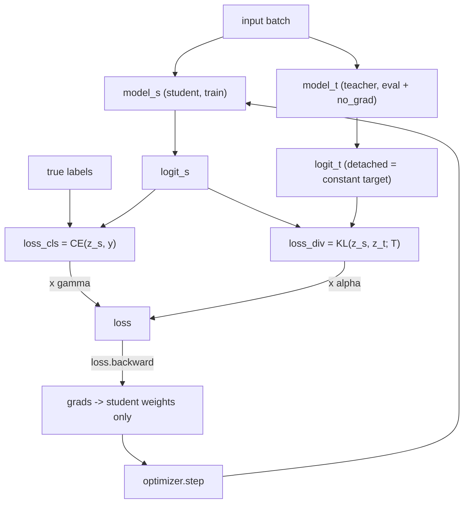

# Understanding Gradient Flow in Knowledge Distillation

A companion guide to [`visualize_grad_flow.py`](visualize_grad_flow.py). It explains
how the KD loss is built, how `loss.backward()` sends gradients through the
student network, and what the script's three charts actually measure.

Run the visualizer to reproduce every number referenced here:

```bash
cd ~/Desktop/RepDistiller
python3 visualize_grad_flow.py -r 0.1 -a 0.9      # standard KD recipe
python3 visualize_grad_flow.py -r 0.9 -a 0.1      # label-dominated (flipped)
python3 visualize_grad_flow.py --kd_T 16          # softer teacher

# Use a REAL trained student instead of random init (recommended):
CK="save/student_model/S:resnet8x4_T:resnet32x4_cifar100_kd_r:0.1_a:0.9_b:0.0_debug/resnet8x4_best.pth"
python3 visualize_grad_flow.py -r 0.1 -a 0.9 --path_s "$CK"
```

> `--path_s` loads a trained checkpoint so the gradients reflect a model that has
> actually learned. Without it the student is randomly initialised, which
> exaggerates the output layer (see section 8).

---

## 1. What one training step does

The script runs a **single** training step and pauses to show the internals. A
normal step is:

1. **Forward pass** — push a batch of images through the student to get predictions.
2. **Compute loss** — measure how "wrong" the predictions are (one number).
3. **Backward pass** (`loss.backward()`) — for every weight, compute *which
   direction to nudge it* to reduce the loss. These directions are the **gradients**.
4. **Update** (`optimizer.step()`) — nudge every weight a tiny step against its gradient.

The script performs steps 1–3 and prints what the gradients look like.

---

## 2. The loss decomposition

The student's total "wrongness" is built from three measurements, then blended
(see [`helper/loops.py`](helper/loops.py)):

```python
loss = opt.gamma * loss_cls + opt.alpha * loss_div + opt.beta * loss_kd
```

| Term | What it measures | Flag | Example weight |
|---|---|---|---|
| `loss_cls` | Cross-entropy: student vs. **true labels** | `-r` / `gamma` | 0.1 |
| `loss_div` | KL divergence: student vs. **teacher** logits | `-a` / `alpha` | 0.9 |
| `loss_kd`  | Extra feature term (FitNet/AT/CRD/…); `0` for plain `kd` | `-b` / `beta` | 0 |

Example output for `-r 0.1 -a 0.9`:

```
loss_cls (CE  vs true labels) = 4.6801   x gamma 0.10 = 0.4680
loss_div (KL  vs teacher    ) = 3.4216   x alpha 0.90 = 3.0794
loss_kd  (feature term      ) = 0.0000   x beta  0.00 = 0.0000
----------------------------------------------------
TOTAL loss                    = 3.5475
```

With `alpha = 0.9`, **~87% of the loss (3.08 / 3.55) comes from "match the
teacher."** The teacher drives this training. Flipping to `-r 0.9 -a 0.1`
reverses it — the true labels dominate instead.

> The *raw* losses barely change between runs (they depend only on the model and
> data). Only the **multipliers** change, and that reweights the whole gradient.

### The KD term in detail

`loss_div` is computed in [`distiller_zoo/KD.py`](distiller_zoo/KD.py):

```python
p_s = F.log_softmax(y_s / self.T, dim=1)   # student softened log-probs
p_t = F.softmax(y_t / self.T, dim=1)       # teacher softened probs
loss = F.kl_div(p_s, p_t, size_average=False) * (self.T ** 2) / y_s.shape[0]
```

Dividing logits by temperature `T` "softens" the distributions so the teacher's
relative confidence across *wrong* classes (its "dark knowledge") becomes a rich
training signal. The `T**2` factor rescales the gradient back to the same order
as `loss_cls`.

---

## 3. Forward and backward flow



**The teacher never learns.** It runs under `torch.no_grad()` and its logits are
`.detach()`-ed, so they are a **constant target**. Gradients flow into the
**student only**. The script confirms this:

```
==> teacher received gradients? False  (expected: False -- it is frozen)
```

---

## 4. Activation gradient vs. weight gradient

A gradient always answers: *"if I wiggle THIS thing, how much does the loss
change?"* The two norms differ in what "THIS thing" is.

| | **Activation gradient** | **Weight gradient** |
|---|---|---|
| Math | $\dfrac{\partial \mathcal{L}}{\partial a}$ | $\dfrac{\partial \mathcal{L}}{\partial W}$ |
| Wiggle what? | the **output values** (activations) a layer produces for this batch | the **weights** inside a layer |
| Depends on the input batch? | **Yes** — different images → different gradient | It is what gets accumulated to learn |
| Used by the optimizer? | **No** — just a messenger passing through | **Yes** — `optimizer.step()` uses exactly this |
| Lives on | the **data flowing between layers** | the **parameters** (`layer.weight.grad`) |
| In the script | captured by a **backward hook** on `grad_output` | read from `p.grad` per parameter |

### A single layer

For a layer computing `a_out = W · a_in`:

```
        a_in  ──►  [ layer: multiply by W ]  ──►  a_out  ──► ... ──► LOSS
                          ▲                         │
                   weight gradient            activation gradient
                   dL/dW                       dL/d(a_out)
                                              (flows backward)
```

During `loss.backward()`, the layer receives the **activation gradient** from the
layer above, then does two things:

1. **Compute its weight gradient** (to learn):
   $$\frac{\partial \mathcal{L}}{\partial W} = \frac{\partial \mathcal{L}}{\partial a_{\text{out}}} \cdot a_{\text{in}}$$
   stored in `W.grad`; the optimizer uses it. **This changes the model.**

2. **Pass the signal further back** to the previous layer:
   $$\frac{\partial \mathcal{L}}{\partial a_{\text{in}}} = W^\top \cdot \frac{\partial \mathcal{L}}{\partial a_{\text{out}}}$$
   the activation gradient the next-lower layer receives.

> **Activation gradient = the messenger travelling backward.
> Weight gradient = what each layer extracts from the messenger to update itself.**

---

## 5. Reading the charts

The network is a pipeline, in order:

```
input → conv1 → layer1 → layer2 → layer3 → fc → prediction → LOSS
```

The loss is computed right after `fc`, so backprop visits `fc` first, then walks
back to `conv1`.

### Chart 1 — Activation-gradient norm (the messenger in transit)

```
conv1    | ##############         1.0593e-02
layer1   | ####                   3.1817e-03
layer2   | ###                    2.4078e-03
layer3   | ####                   2.7939e-03
fc       | ###################### 3.6872e-02   <- strongest, born at the loss
```

- `fc` is closest to the loss → **freshest, strongest** signal.
- The signal **attenuates** as it flows back through `layer3 → layer2 → layer1`.
- `conv1` ticks back up due to **skip connections** and the large early feature map.

This signal is **not** used to change weights directly — it is the chain-rule
product being carried backward.

### Chart 2 — Weight-gradient norm (the actual update)

```
conv1    | #                       5.27e-02
layer1   | #                       6.52e-02
layer2   | ##                      7.74e-02
layer3   | ###                     1.67e-01
fc       | ###################### 2.42e+00    <- biggest update
```

- `fc` dominates because **both** active loss terms attach directly to the logits
  it produces.
- This **is** what `optimizer.step()` consumes:
  $$W_{\text{new}} = W_{\text{old}} - \text{lr} \times \frac{\partial \mathcal{L}}{\partial W}$$

> There is also a **Chart 3 — Relative update**, covered in section 8, which is
> the fairest per-layer "did it actually move?" metric.

### Why the first two charts don't match in size

`fc`'s activation gradient (0.037) is small, but its weight gradient (2.42) is
huge. The weight gradient also depends on **how large the input activations
$a_{\text{in}}$ were**:
$$\frac{\partial \mathcal{L}}{\partial W} = \frac{\partial \mathcal{L}}{\partial a_{\text{out}}} \cdot a_{\text{in}}$$
`fc` receives a large feature vector as input, which multiplies up its weight
gradient. A modest messenger can still produce a large update if the layer's
inputs are large.

---

## 6. The story of one step

```
1. Images go in → student makes predictions (forward).
2. Loss = 0.1 x (wrong vs labels) + 0.9 x (different from teacher) = 3.55.
3. backward(): error signal born at fc (strong), flows back to conv1 (weak).   [Chart 1]
4. That signal becomes a weight-update size for each stage; fc gets the most.   [Chart 2]
5. optimizer.step() nudges each weight; fc moves most, conv1 least.
6. Teacher never changes — it is just the reference.
```

**Key insight:** changing the loss weights (`-r` / `-a`) **rescales** the gradient
signal and shifts where it comes from, but does **not** change the *route* it
takes through the network. The architecture defines the path; the loss weights
define the strength and source.

- **High `alpha` (teacher):** smaller, output-focused gradients — the student
  mimics the teacher's distribution. This is what lifts `resnet8x4` above
  label-only training.
- **High `gamma` (labels):** larger, network-wide gradients — the student fits the
  ground truth directly, ignoring the teacher's dark knowledge.

The standard recipe is `-r 0.1 -a 0.9` because the teacher's soft signal
generalizes better than one-hot labels.

---

## 7. Inspect it live in the debugger

Set a breakpoint on `loss.backward()` in [`visualize_grad_flow.py`](visualize_grad_flow.py)
(or in [`helper/loops.py`](helper/loops.py)), then step over it and inspect:

```python
model_s.fc.weight.grad.norm()   # populated right after backward()
model_t.fc.weight.grad          # None — teacher is frozen
logit_t.requires_grad           # False — constant target
```

Before `backward()` all `.grad` are `None`; stepping over that one line fills them
in — that is the moment "loss impacts the model."

### Harmless warnings

- `size_average ... will be deprecated` — from `DistillKL` using an old PyTorch
  argument name. Does not change any number.
- `Full backward hook is firing...` — because the random input does not itself
  require gradients. The captured layer gradients are still correct.

---

## 8. Chart 3 — Relative update (the fair "did it move?" metric)

The raw weight-gradient norm is a **biased ruler**: it is inflated for the output
layer by both the large input activations it receives and its weight scale. To
compare layers fairly, the script adds a third panel, the **relative update**:

$$
\text{relative update} = \frac{\lVert \text{lr}\cdot \nabla W\rVert_2}{\lVert W\rVert_2}
$$

```python
weight_sq[bucket] += p.detach().norm().item() ** 2                  # ||W||^2
update_sq[bucket] += (opt.lr * p.grad.detach().norm().item()) ** 2  # ||lr*grad||^2
rel = (update_sq[n] ** 0.5) / (weight_sq[n] ** 0.5 + eps)
```

**It is NOT divided by the number of weights.** The L2 norm already grows like
$\sqrt{N}$, so dividing by `N` would over-shrink big layers. Dividing by
$\lVert W\rVert$ cancels the `N` dependence and leaves a dimensionless *fraction*
of how far the weights shifted, relative to their own size.

---

## 9. Random vs. trained student (why the output layer's dominance is an artifact)

The single-step `fc` dominance you see is largely an artifact of starting from a
**randomly initialised** student. Loading a real checkpoint (`--path_s`) changes
the picture completely. Example, `resnet8x4_best.pth` at 58.45%:

**Weight-gradient norm** (raw update size):

| stage | RANDOM | TRAINED (58.45%) |
|---|---|---|
| conv1 | 0.051 | 0.125 |
| layer1 | 0.063 | 0.373 |
| layer2 | 0.073 | 0.565 |
| layer3 | 0.156 | 0.900 |
| fc | 2.420 | 1.279 |

`fc`/`conv1` ratio falls from **~47x (random)** to **~10x (trained)**.

**Relative update** (fair metric):

| stage | RANDOM | TRAINED (58.45%) |
|---|---|---|
| conv1 | 1.03e-03 | 4.49e-04 |
| layer1 | 1.50e-04 | 7.01e-04 |
| layer2 | 1.21e-04 | 6.94e-04 |
| layer3 | 1.84e-04 | 8.25e-04 |
| fc | 2.10e-02 | 2.09e-03 |

In the trained model the middle layers all sit at a similar, healthy
~7-8e-04 — they are clearly moving by a comparable *fraction* of their own size.
The network's gradient is **not** concentrated only at `fc`. This is the direct
rebuttal to "most updates happen at fc, so the rest didn't learn."

---

## 10. Movement is NOT the same as learning

A recurring trap: a bigger gradient/update does not mean a layer "learned more."

| Metric | Measures | Good proxy for learning? |
|---|---|---|
| Activation-gradient norm | strength of error signal in transit | No |
| Weight-gradient norm | raw update size | No (biased by scale & input) |
| Relative update | fraction the weights move this step | Better, but still *movement* |

**Why movement != learning:**

1. **Big movement can be bad** — an update can overshoot and *increase* loss.
2. **Movement can be wasted** — weights oscillate back and forth with near-zero
   net change.
3. **Learning slows movement near convergence** — a converged layer sits where
   the gradient -> 0, so it moves *less* precisely because it learned *more*.
4. **Small movement can yield large learning** — a tiny change in an early-layer
   feature detector can ripple through the whole network (leverage).
5. **Movement is internal; learning is external** — movement is a property of the
   weights; learning is a property of task performance (accuracy/generalization).

```
movement = ||dW||           (internal, this step, no sign of "good")
learning = d(val accuracy)  (external, over time, signed toward "good")
```

They correlate early in training (you must move to learn) but **decouple** later.

**What actually quantifies learning** (none are single-step gradient numbers):

- **Validation accuracy / loss over epochs** — the ground truth (e.g. this run's
  51% -> 55% -> 58%).
- **Cumulative weight drift** between checkpoints:
  $\lVert W_{\text{final}} - W_{\text{init}}\rVert / \lVert W_{\text{init}}\rVert$.

A single backward pass can only tell you how much a layer is *about to move* — not
how much it has *learned*.
